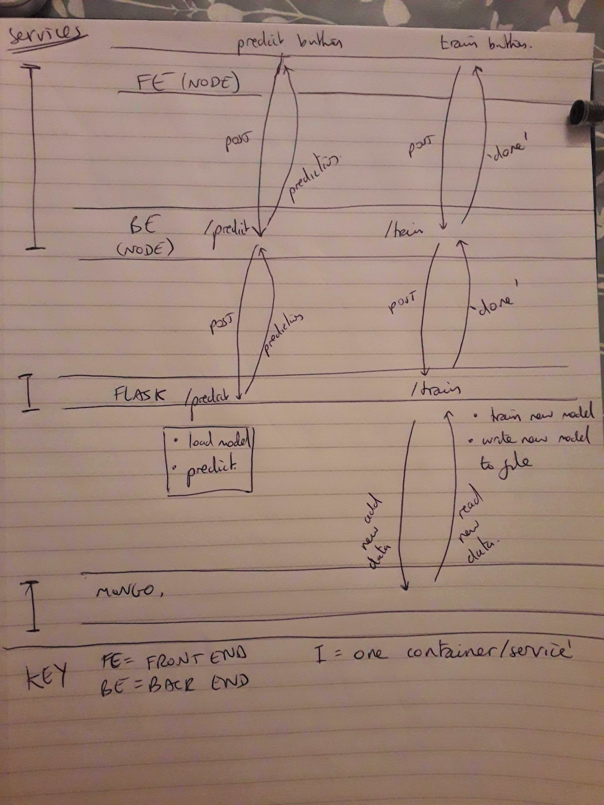

# fullstackML

Full stack architecture for deploying machine learning models using node and python

This will allow users to either upload training data or upload data to be predicted
Training: Data will be written to mongoDb then model will be trained and saved to file
Predicion: Data is used as input features to model, prediction is returned

Model: The model will be serialised with the python library pickle and saved as a .sav file in a S3 bucket

Services:

* node service - provides endpoints for front end to query

* flask service - provides endpoints for node service to query, does machine learning training and predictions in python

* mongodb service - holds training data

Below is a schematic showing the microservices architecture and API routes:

## Local Environment Setup

- Use `docker-compose up -d --build` to start the application.
- It is possible to configure the bound ports using a .env file. See docker-compose.yml for available environment variables.